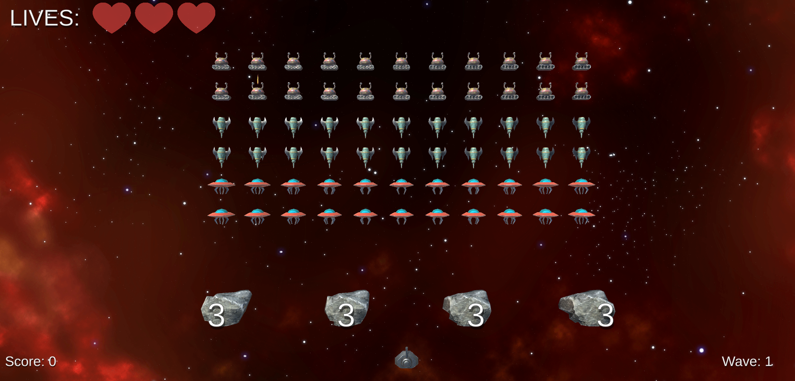

# Space Invaders

The project represents a clone of a well-known game [Space Invaders](https://www.crazygames.com/game/space-invaders).

The game starts with a loading screen, in the *main menu*, we can proceed to the *start game* and the *high score* page. The *high score* page contains the 10 last saved highest scores.

In the beginning, the enemies slide towards the middle of the screen and move horizontally. Every time they touch the wall, they move in the opposite direction and down a little bit. The player dies if he loses all his lives. We acquire score points every time we destroy an enemy. The game is an infinite loop and a new wave appears when a player kills all the space ships on the screen. Moreover, shields in form of rocks appear just above the player which guard the player from enemies' projectiles. 

## Features

- **Dependency Injection** (examples in classes: *PlayerHealth*, *Enemy* - but there are a lot of them in the project),
- **Obsever Pattern** (examples in classes: *Enemy* - *EnemyWaveMovement*, *CheckEnemy* - *WaveManager*),
- **Inheritance** (example: ScorableEntety, Enemy, UfoHealth),
- **Interfaces** (example: ),
- **Config files (Scriptable Objects)** (examples in classes: *ShipSettings*, *ProjectileConfig*),
- **Object Pooling** (class: *GameObjectPool*),
- **Serialized saving system** (class: *SaveSystem*),
- **Scalable canvas**.

## Additional Resources
[Dynamic Space Background Lite](https://assetstore.unity.com/packages/2d/textures-materials/dynamic-space-background-lite-104606#description) by DinV Studio
[Rock package](https://assetstore.unity.com/packages/3d/props/exterior/rock-package-118182#description) by shui861wy
[Simple UFO 3D Model](https://free3d.com/3d-model/simple-ufo-22633.html) by iphacker786
